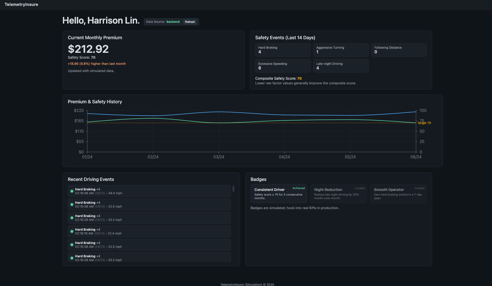

 ## Telematics Integration in Auto Insurance (Proof of Concept)

**NOTE: This project was built across 3 days as part of the take-home project for the final round interview for Insurity AI for the Fall 2025 Quarter.**




This repository contains a prototype implementation for a telematics-enabled, usage-based auto insurance platform. It includes an entire data pipeline that takes telemetry data from cars, and actively uses live-streamed data to predict monthly insurance premiums for drivers.

### Key Goals

- Fairer pricing via behavior-based risk assessment
- Transparency for policyholders (see how driving impacts premiums)
- Extensible architecture for real telematics ingestion, ML scoring, and pricing engines


## Quick Start (Frontend)

```bash
cd src/frontend
npm install
npm run dev
```

Open http://localhost:5173/ in your browser.

Production build:

```bash
npm run build
npm run preview
```

## Quick Start (Cloud Backend)

**NOTE: Ensure that you have a provisioned AWS IAM User that is allowed to provision the following services (AWS Kinesis, AWS Lambda, AWS S3 Bucket, AWS DynamoDB, AWS Sagemaker)**

**NOTE: Due to the limited time, there is an unfixed bug within the data pipeline that causes data to not reach the database. However, data WILL post an 200 "OK". However, the script DOES provision all the required infrastructure correctly, with IAM permissions.** 

**<u>Docker, Terraform, and Python is REQUIRED to deploy to cloud.</u>**

```bash
# install deps
pip install .
```

Ensure AWS CLI Tools are enabled.

```bash
# if not installed, please set it up w/an IAM user that has valid permissions.
aws --version
aws configure list
```

Build model locally:
```bash
python models/aws_sagemaker/xgboost_model.py --local-train --model-dir artifacts
```

Run terraform scripts:

```bash
# navigate to tf script
cd bin/deploy

terraform init
terraform plan -out plan.tfplan
terraform apply plan.tfplan

# This may take 4-7 minutes, since sagemaker is slow, and dependencies have to be compiled + zipped for lambda
# This will set up all the AWS infrastructure automatically without manual intervention.
```

Test Endpoints:

```bash
cd ..

# emits randomly generated data to POST
python test_api_endpoint.py
python test_dashboard_api.py
```

## Quick Start (Local Backend)

```bash
# install deps
pip install .
```

Build model locally:
```bash
python models/aws_sagemaker/xgboost_model.py --local-train --model-dir artifacts
```

Run Mock Local Server:
```bash
cd bin/local
# look at local_dev.md in /docs for tags to simulate specific drivers + events
python mock_dashboard_server.py --bad-driver
```

Run frontend:
```bash
cd ../../src/frontend

npm install
npm run dev
```


### Architecture Notes


*The diagram file can be found in <u>/docs/InsurityAI.drawio</u>*

| Layer | Purpose | Technologies |
|-------|---------|--------|
| Data Ingestion | Collect telematics (GPS, accelerometer, speed) | Telemetry Device, AWS API Gateway |
| Processing / Feature Store | Clean & aggregate trip metrics | Python, AWS Lambda, AWS Kinesis, AWS S3, AWS DynamoDB |
| Risk Scoring | ML / heuristic safety scoring | Python, AWS Lambda, AWS Sagemaker |
| Pricing Engine | Adjust premium based on score & base rate | Python, AWS Lambda |
| User Dashboard | Visual transparency & engagement | React, Vite, Typescript |


### XGBoost Model Evals (Synthetic-only Data)
``` bash
Training channel not provided or missing; generating synthetic data.
[0]     train-rmse:0.16389      validation-rmse:0.14940
[25]    train-rmse:0.03520      validation-rmse:0.03584
[50]    train-rmse:0.02025      validation-rmse:0.02419
[75]    train-rmse:0.01726      validation-rmse:0.02211
[100]   train-rmse:0.01589      validation-rmse:0.02115
[125]   train-rmse:0.01515      validation-rmse:0.02067
[150]   train-rmse:0.01463      validation-rmse:0.02037
[175]   train-rmse:0.01426      validation-rmse:0.02023
[200]   train-rmse:0.01393      validation-rmse:0.02018
[225]   train-rmse:0.01362      validation-rmse:0.02014
[250]   train-rmse:0.01335      validation-rmse:0.02013
[275]   train-rmse:0.01310      validation-rmse:0.02012
[300]   train-rmse:0.01287      validation-rmse:0.02011
[325]   train-rmse:0.01265      validation-rmse:0.02009
[350]   train-rmse:0.01245      validation-rmse:0.02011
[357]   train-rmse:0.01240      validation-rmse:0.02011
/Users/harrisonlin/Documents/CodingFiles/ML/Insurity AI/models/aws_sagemaker/xgboost_model.py:139: UserWarning: [01:56:18] WARNING: /Users/runner/work/xgboost/xgboost/src/c_api/c_api.cc:1427: Saving model in the UBJSON format as default.  You can use file extension: `json`, `ubj` or `deprecated` to choose between formats.
  self.booster.save_model(str(model_dir / "xgboost-model"))
Model saved to /Users/harrisonlin/Documents/CodingFiles/ML/Insurity AI/artifacts
Metrics: {
  "validation_rmse": 0.02010705901673811,
  "best_iteration": 332,
  "pred_p5": 0.3722415268421173,
  "pred_p50": 0.4464823603630066,
  "pred_p95": 0.9559996128082275,
  "pred_std": 0.15891540050506592
}
```


### Repository Structure

```
src/                   # Frontend + Lambda Code 
models/                # Model artifacts (XGBoost)
data/                  # Sample/synthetic datasets
docs/                  # In-depth design notes, diagrams, research
bin/                   # Utility scripts
```